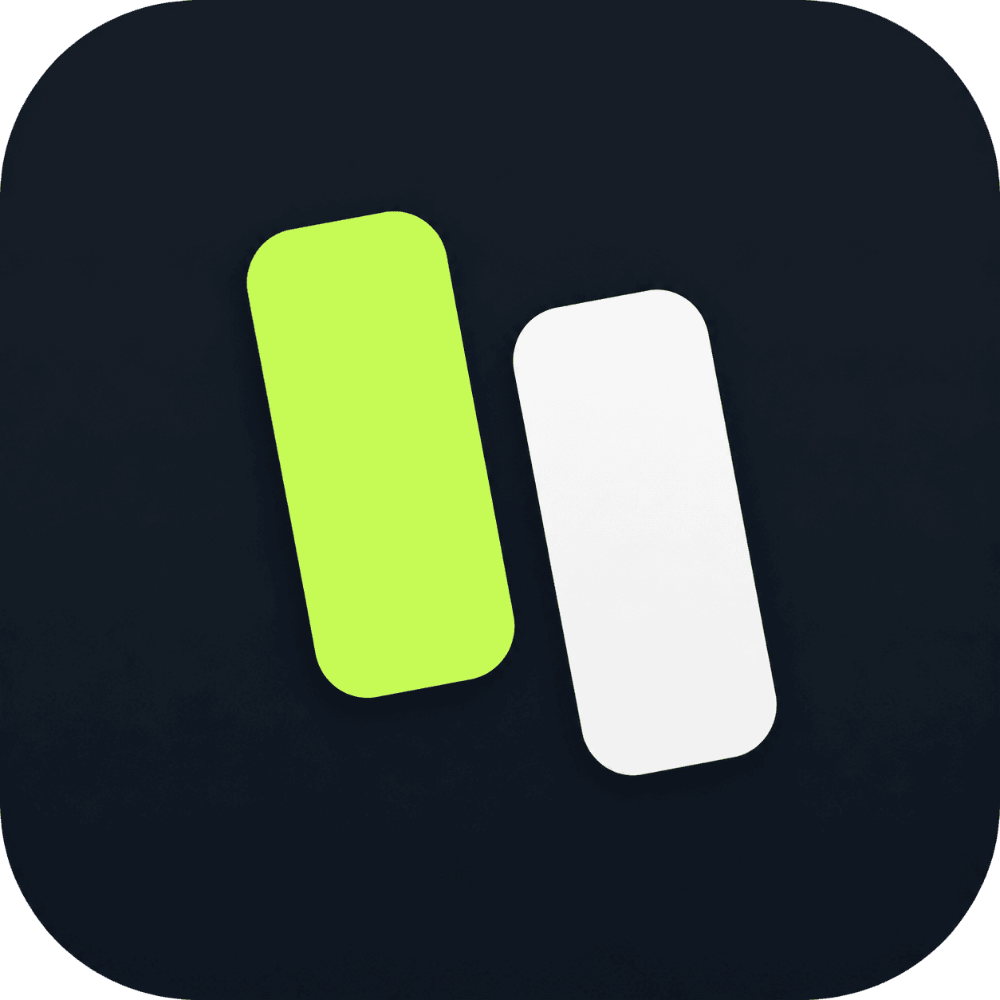

<p align="center">
  
</p>

<h1 align="center">Focen</h1>
<p align="center"><strong>Focus Protocol - an advanced website blocker with time limits, refractory periods, and strict disable rules.</strong></p>

<p align="center">
  
  
  
</p>

---

## ✨ What it does

Focen blocks distracting websites so you can stay focused. Unlike simple blockers, it gives you **granular control** - set daily time allowances, enforce refractory cool-down periods between browsing sessions, and make it intentionally hard to disable protections.

## 🎯 Key Features

| Feature | Description |
|---|---|
| **Focus Groups** | Organize blocked websites into named groups with independent rules |
| **Always Block** | Completely blocks all sites in a group - no exceptions |
| **Daily Time Allowance** | Allow a set number of minutes per day, then block automatically |
| **Periods & Refractory** | Browse in timed windows, then enforce a mandatory cool-down before the next session |
| **Pre-block Screen** | Show a customizable pause screen (e.g. *"Breathe in..."*) with a countdown before opening a tracked site |
| **Live Timer** | A small floating timer shows remaining time on tracked pages |
| **Intentional Disable** | To pause a group you must type a confirmation sentence - preventing impulsive overrides |
| **Disable for Today** | Optionally pause a group until tomorrow - it auto-resumes the next day |
| **Full-screen Block** | When time runs out, the page is replaced by a full-screen overlay |

## 🔄 Blocking Modes

### 1. Always Block
All websites in the group are blocked at all times. No workaround.

### 2. Daily Time Allowance
Set a daily budget (e.g. 30 minutes). Time is tracked per-domain. Once the budget is exhausted, the site is blocked for the rest of the day.

### 3. Periods & Refractory
The most advanced mode:
- **Focus window** - how many minutes you can browse before a break is forced.
- **Refractory period** - how long the site stays blocked after a window expires.
- **Daily allowance** - a hard cap that overrides everything once reached.

## 🛠 Installation

1. Clone or download this repository.
2. Open `chrome://extensions` in Chrome (or any Chromium-based browser).
3. Enable **Developer mode** (top-right toggle).
4. Click **Load unpacked** and select the `Focen-extension` directory.
5. Click the Focen icon in the toolbar to open the popup and create your first focus group.

## 📸 How it works

1. Click the **Focen** icon in the toolbar to open the settings popup.
2. Create a **Focus Group** and add the domains you want to limit (one per line).
3. Choose a **Blocking Mode** - Always Block, Daily Time Allowance, or Periods & Refractory.
4. Optionally enable the **Pre-block Screen** with a custom message and countdown.
5. Click **Save group** - Focen starts enforcing immediately.

## 📁 Project Structure

```
Focen-extension/
├── manifest.json              # Chrome extension manifest (v3)
├── focen.png                  # Extension icon
├── background/
│   ├── background.js          # Service worker - time tracking, blocking logic, alarm evaluation
│   └── storage.js             # Chrome storage wrapper (groups + stats)
├── content/
│   ├── content.js             # Injected script - overlay, live timer, block enforcement
│   └── content.css            # Styles for block overlay and floating timer
└── popup/
    ├── popup.html             # Settings popup page
    ├── popup.css              # Popup styles
    └── popup.js               # Popup UI logic (group CRUD, disable modal)
```

## 🔐 Permissions

| Permission | Why |
|---|---|
| `storage` | Persists focus groups, settings, and daily stats |
| `tabs` | Reads the active tab URL to track time per-domain |
| `alarms` | Supports scheduled alarm-based events |
| `<all_urls>` (host) | Content script runs on every page to show overlays and timers |

## 🧰 Tech Stack

- **Manifest V3** service worker architecture
- **Chrome Storage API** for persistent settings and daily stats
- **Content Scripts** for in-page overlays and live timers
- Vanilla HTML / CSS / JavaScript - zero build step

## ⚠️ Anti-Cheat Design

Focen is designed to resist impulsive disabling:

- **Confirmation sentence** - You must type *"I am intentionally pausing this focus group."* exactly to disable a group.
- **Disable-for-today** option auto-re-enables the group the next day, so you can't permanently disable it on impulse.
- The full-screen block overlay uses the **maximum z-index** (`2147483647`) so it can't be casually dismissed.

## 📄 License

MIT - free to use, modify, and distribute.
